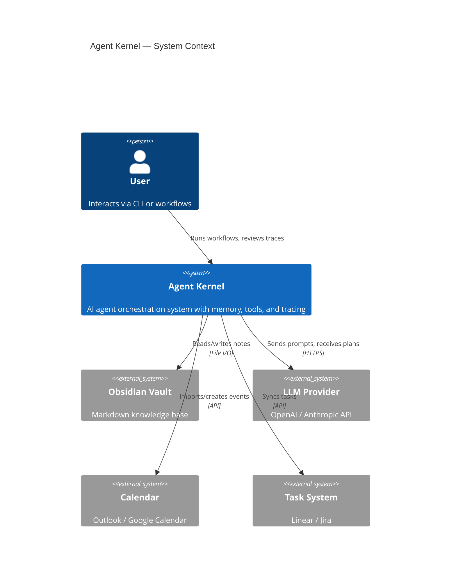
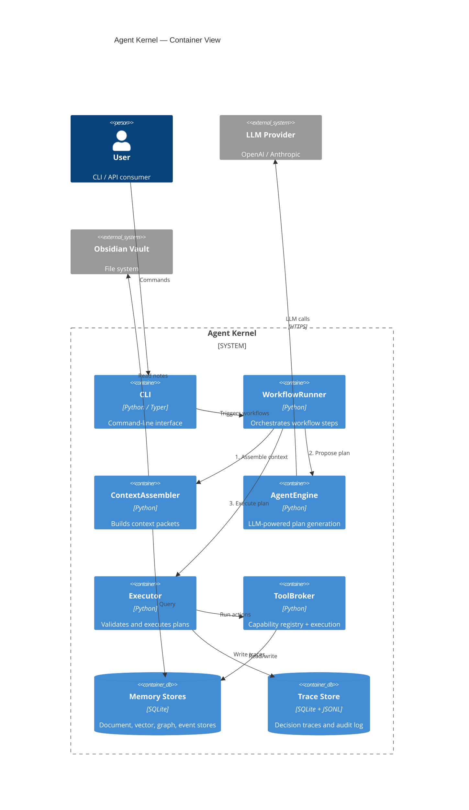
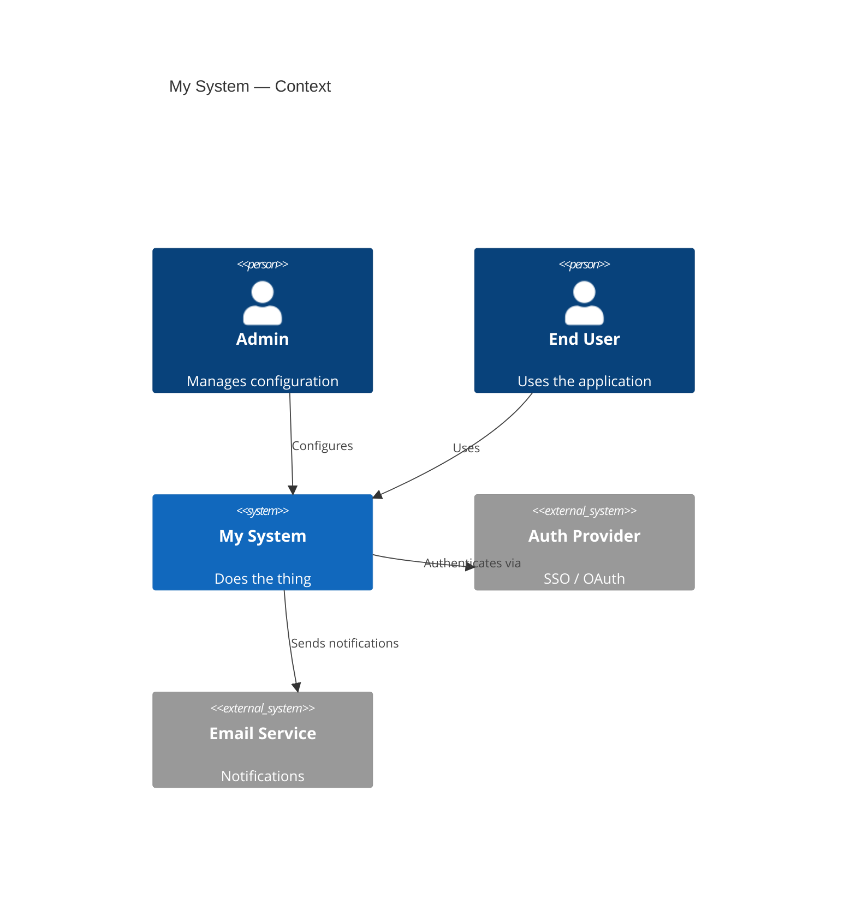
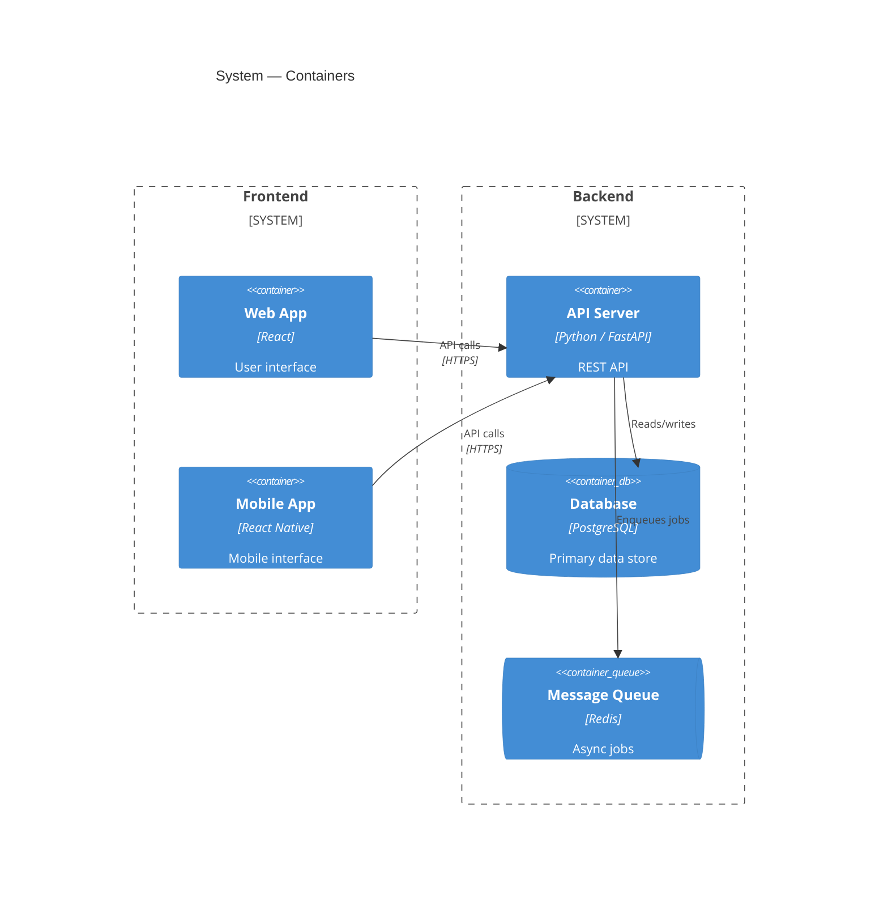
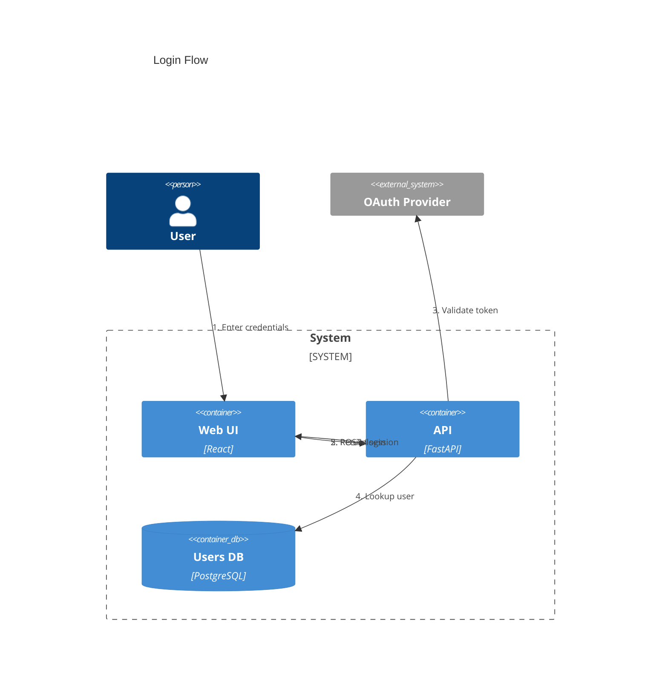

# C4 Architecture Diagram Reference

## When to Use

- Communicating system architecture at different zoom levels
- Showing system boundaries and external actors (Context level)
- Showing internal containers and technology choices (Container level)
- Stakeholder communication (non-technical audiences understand C4)
- Architecture Decision Records (ADR) illustrations

## Zoom Levels

| Level | Shows | Audience |
|-------|-------|----------|
| **Context** | System + external actors + other systems | Everyone |
| **Container** | Containers within one system (apps, DBs, queues) | Technical stakeholders |
| **Component** | Components within one container | Developers |
| **Deployment** | Infrastructure and deployment topology | DevOps |

Start at Context, drill down as needed. Most diagrams need only Context +
Container.

## Canonical Examples

### C4 Context Diagram



### C4 Container Diagram



## Syntax Quick Reference

### Element Types

| Function | Description |
|----------|-------------|
| `Person(id, "name", "desc")` | Human actor |
| `Person_Ext(id, "name", "desc")` | External human actor |
| `System(id, "name", "desc")` | Software system |
| `System_Ext(id, "name", "desc")` | External system |
| `System_Boundary(id, "name") { ... }` | Boundary grouping |
| `Container(id, "name", "tech", "desc")` | Container (app/service) |
| `ContainerDb(id, "name", "tech", "desc")` | Database container |
| `ContainerQueue(id, "name", "tech", "desc")` | Message queue |
| `Component(id, "name", "tech", "desc")` | Component within container |
| `Deployment_Node(id, "name", "tech") { ... }` | Infrastructure node |

### Relationships

```
Rel(from, to, "label")
Rel(from, to, "label", "technology")
Rel_D(from, to, "label")   %% Down
Rel_U(from, to, "label")   %% Up
Rel_L(from, to, "label")   %% Left
Rel_R(from, to, "label")   %% Right
BiRel(a, b, "label")       %% Bidirectional
```

### Layout Configuration

```
UpdateLayoutConfig($c4ShapeInRow="3", $c4BoundaryInRow="1")
```

- `$c4ShapeInRow` — elements per row (default: 4)
- `$c4BoundaryInRow` — boundaries per row (default: 2)

### Styling (C4-specific)

```
UpdateElementStyle(id, $fontColor="red", $bgColor="#08427B", $borderColor="blue")
UpdateRelStyle(from, to, $textColor="blue", $lineColor="blue")
```

## Common Patterns

### 1. System Context with Multiple Actors



### 2. Container with Boundaries



### 3. Dynamic / Sequence-Style C4

For showing a specific flow through the architecture, use numbered relationships:



## Pitfalls

### Layout Control

C4 diagrams have limited layout control. You cannot precisely position elements.
Use these strategies:

- `Rel_D`, `Rel_U`, `Rel_L`, `Rel_R` to hint direction
- `UpdateLayoutConfig` to control elements per row
- Statement order affects layout — experiment with ordering
- If layout is unacceptable, consider a flowchart with C4-style labeling

### Label Overlap

With many relationships, labels can overlap. Mitigation:

- Keep relationship labels short (2-4 words)
- Use the technology parameter for protocol details
- Increase diagram dimensions in `mermaid_preview`
- Remove obvious relationship labels (e.g., "Uses" between User and System)

### When to Prefer Flowcharts Over Native C4

Consider using a styled flowchart instead of native C4 when:

- You need precise control over layout and positioning
- You want to use the semantic color palette (C4 has its own fixed styling)
- The diagram has complex internal flows (C4 is best for boundaries, not flows)
- You need subgraph nesting deeper than 2 levels

### C4 Doesn't Support classDef

C4 diagrams have their own styling system. Don't try to use `classDef` — use
`UpdateElementStyle` instead. For full palette control, use flowcharts.

### Missing Diagram Type

Always specify the C4 level as the diagram type:

```
C4Context      %% Not just "graph" or "flowchart"
C4Container
C4Component
C4Deployment
```
