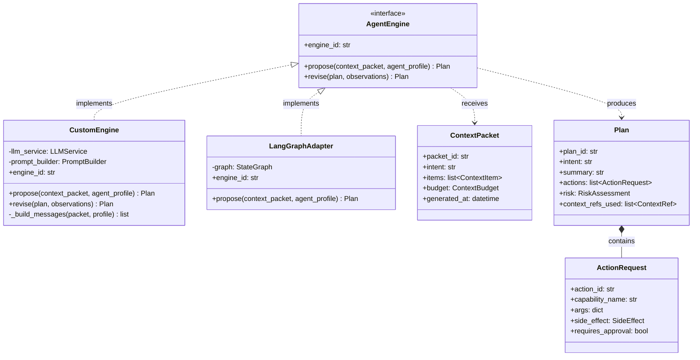
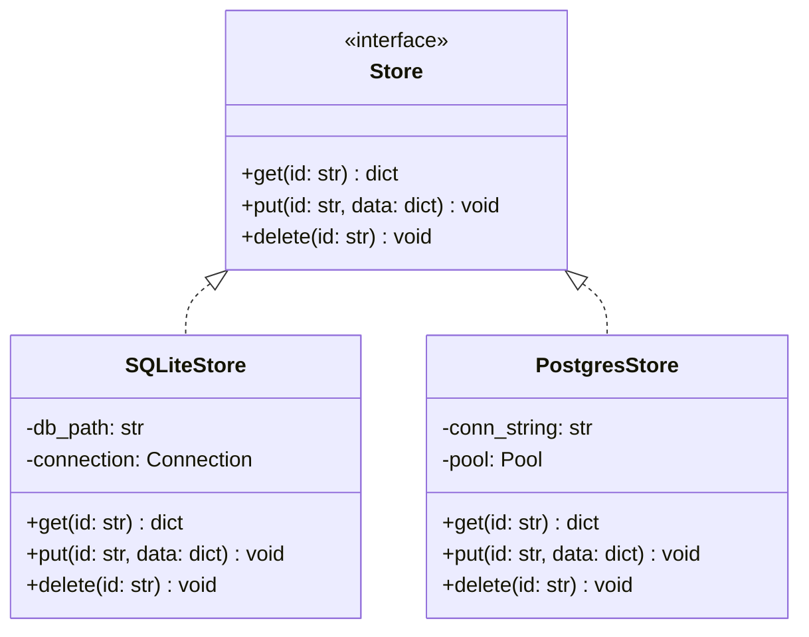
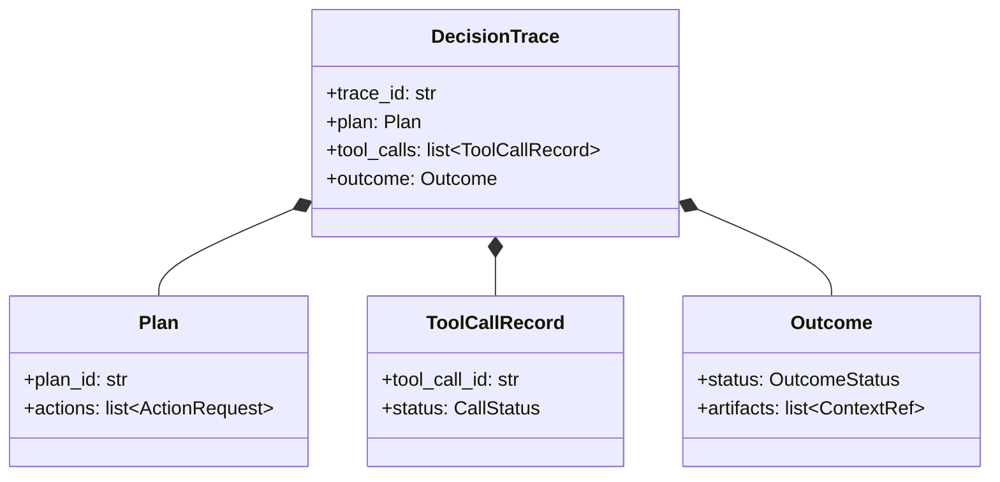
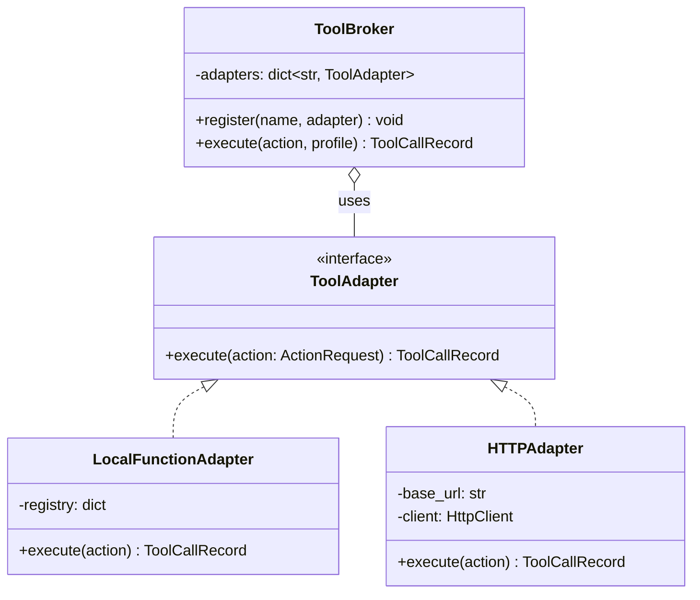

# UML Class Diagram Reference

## When to Use

- Object-oriented design and type hierarchies
- Interface definitions and implementations
- Design pattern documentation (adapter, strategy, observer)
- Pydantic model relationships (inheritance, composition)
- API contract visualization

## Canonical Example



## Syntax Quick Reference

### Visibility Modifiers

| Symbol | Meaning |
|--------|---------|
| `+` | Public |
| `-` | Private |
| `#` | Protected |
| `~` | Package/internal |

### Method Syntax

```
+method_name(param1, param2) ReturnType
-_private_helper() void
#protected_method(arg: str) bool
+static_method()$ ReturnType     %% $ = static
+abstract_method()* ReturnType   %% * = abstract
```

### Stereotypes

```mermaid
class MyInterface {
    <<interface>>
}

class MyAbstract {
    <<abstract>>
}

class MyEnum {
    <<enumeration>>
    VALUE_A
    VALUE_B
}

class MyService {
    <<service>>
}
```

### Relationship Arrows

| Syntax | Type | Use for |
|--------|------|---------|
| `A <\|-- B` | Inheritance | B extends A |
| `A <\|.. B` | Implementation | B implements interface A |
| `A *-- B` | Composition | A contains B (strong ownership) |
| `A o-- B` | Aggregation | A has B (weak ownership) |
| `A --> B` | Association | A uses B |
| `A ..> B` | Dependency | A depends on B (dashed) |
| `A -- B` | Link | Unspecified association |

### Cardinality

```mermaid
A "1" --> "*" B : contains
A "0..1" --> "1..*" B : references
```

### Generics

Use `~T~` syntax (NOT `<T>` which breaks Mermaid parsing):

```mermaid
class Repository~T~ {
    +get(id: str) T
    +list() list~T~
    +save(item: T) void
}
```

### Annotations and Notes

```mermaid
class MyClass {
    +field: str
}
note for MyClass "This is a note\nthat spans lines"
```

## Common Patterns

### 1. Interface + Implementations



### 2. Composition



### 3. Adapter Pattern



## Pitfalls

### Generics Use `~T~` Not `<T>`

Angle brackets break Mermaid's parser. Always use tildes:

```
%% BAD — parse error
class List<T> {
    +get(index: int) T
}

%% GOOD
class List~T~ {
    +get(index: int) T
}
```

### classDef Doesn't Work

Class diagrams do **not** support `classDef` styling. You cannot color
individual classes. If you need colors, consider a flowchart with class-shaped
nodes. Use stereotypes (`<<interface>>`, `<<abstract>>`) for visual
differentiation instead.

### Method Parentheses

Methods require parentheses even with no parameters:

```
%% BAD — treated as attribute
+getName str

%% GOOD
+getName() str
```

### Large Class Diagrams

- Show only fields/methods relevant to the design point you're making
- Omit getters/setters and boilerplate methods
- Group related classes; don't show the entire codebase
- For Pydantic models, show key fields not all inherited methods

### Relationship Labels

Add labels to clarify non-obvious relationships:

```mermaid
Engine ..> Plan : "produces"
Executor ..> Plan : "validates"
```

Without labels, it's unclear what the association means.
