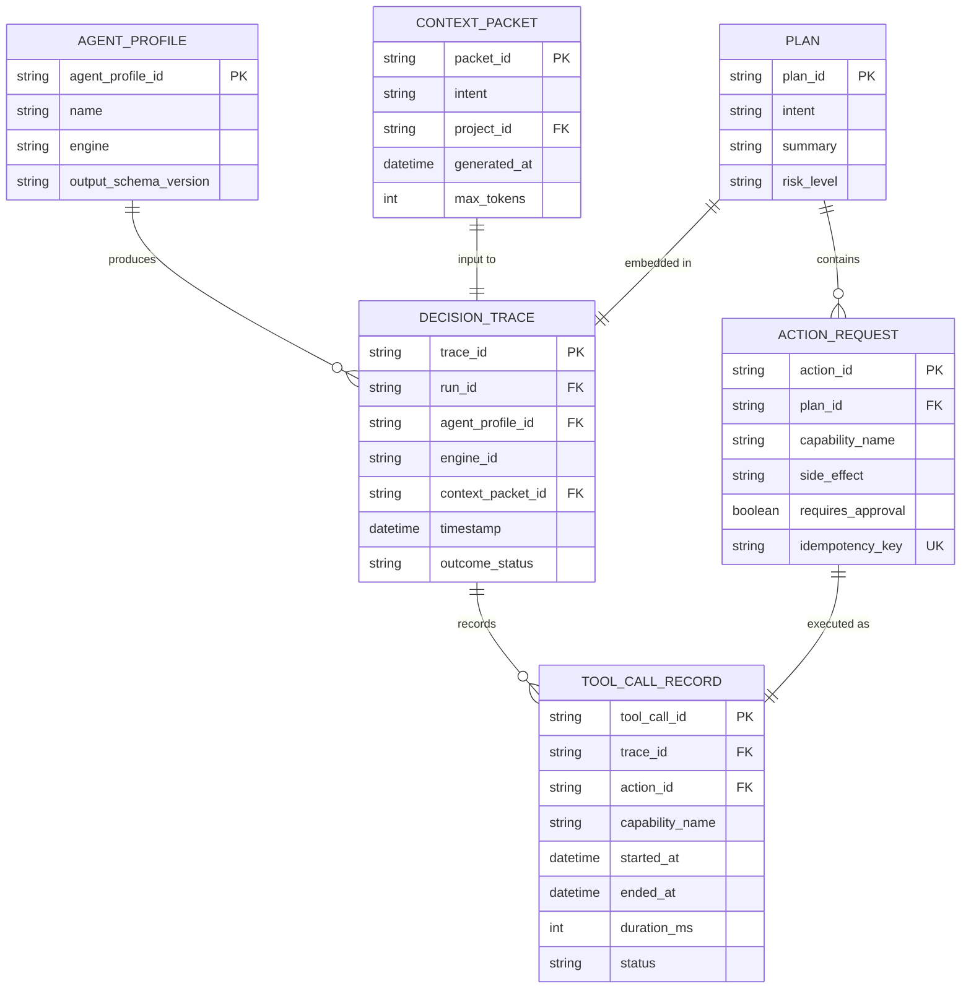
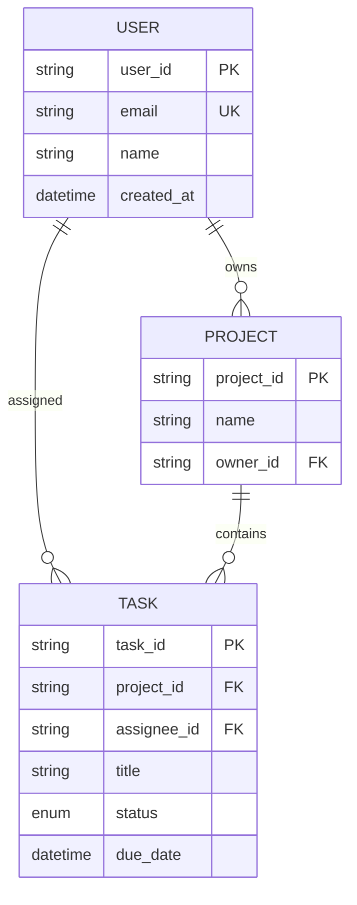
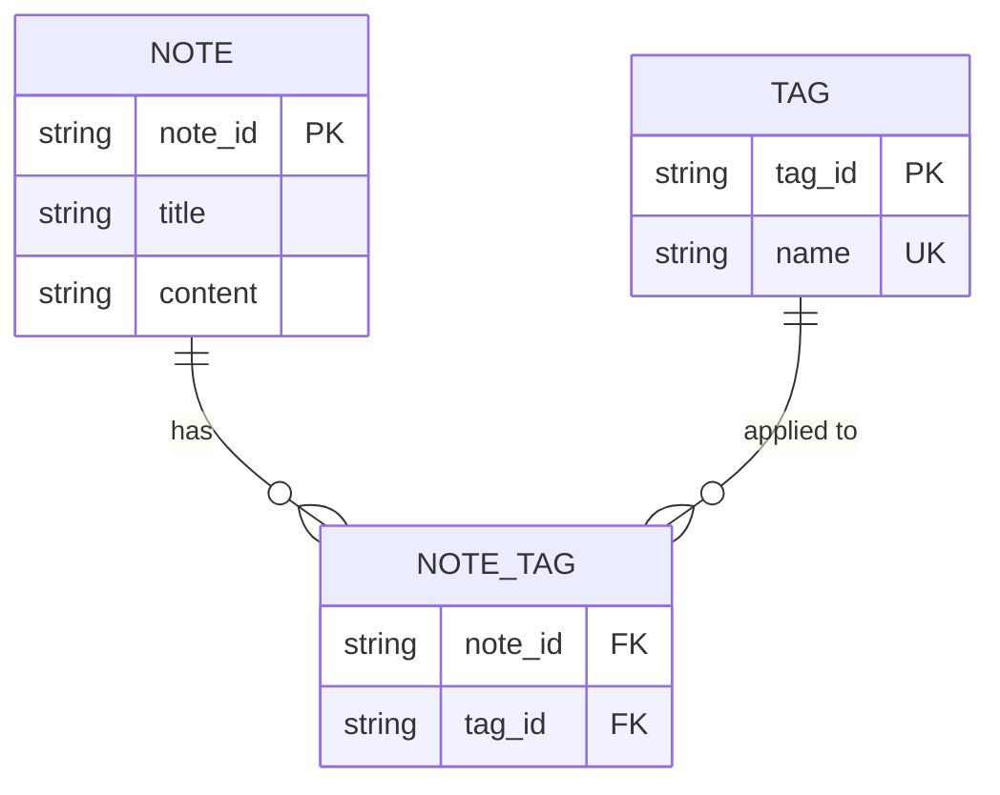

# Entity-Relationship Diagram Reference

## When to Use

- Database schemas and table designs
- Data model documentation
- Cardinality and relationship documentation
- Pydantic model / schema visualization
- Any time you need to show "what data exists and how it connects"

## Canonical Example



## Syntax Quick Reference

### Entity Definition

```mermaid
ENTITY_NAME {
    type attribute_name constraint
}
```

Constraints: `PK` (primary key), `FK` (foreign key), `UK` (unique key)

### Attribute Types

Use simple type names that map to your domain:

| Type | Represents |
|------|-----------|
| `string` | Text, varchar, str |
| `int` | Integer, numeric ID |
| `float` | Decimal, float |
| `boolean` | True/false |
| `datetime` | Timestamp, date |
| `json` | JSON/dict blob |
| `enum` | Enumerated type |

### Crow's-Foot Cardinality

| Notation | Meaning | Read as |
|----------|---------|---------|
| `\|\|--\|\|` | Exactly one to exactly one | "one and only one" |
| `\|\|--o\|` | Exactly one to zero or one | "one to optional one" |
| `\|\|--o{` | Exactly one to zero or many | "one to many (optional)" |
| `\|\|--\|{` | Exactly one to one or many | "one to many (required)" |
| `o\|--o{` | Zero or one to zero or many | "optional to many" |
| `o{--o{` | Zero or many to zero or many | "many to many" |

### Relationship Labels

```mermaid
ENTITY_A ||--o{ ENTITY_B : "relationship verb"
```

The label describes the relationship **from left to right**:
- `USER ||--o{ ORDER : "places"` → "A user places zero or many orders"
- `ORDER ||--|{ LINE_ITEM : "contains"` → "An order contains one or many line items"

## Common Patterns

### 1. Normalized Schema



### 2. Junction Table (Many-to-Many)



## Pitfalls

### No Styling Support

ERD diagrams do **not** support `classDef`, `style`, or any custom styling.
Colors and shapes are fixed by the Mermaid theme. If you need colors, consider
a flowchart with entity-shaped nodes instead.

### Relationship Verb Direction

The verb reads **left-to-right** in the source, regardless of how Mermaid
renders the layout. Write verbs from the first entity's perspective:

```
%% GOOD — reads naturally
USER ||--o{ ORDER : "places"

%% CONFUSING — reversed perspective
ORDER }o--|| USER : "places"
```

### Large ERDs

ERDs with more than 10-12 entities become hard to read. Strategies:

- Split into domain-specific diagrams (e.g., "User domain", "Billing domain")
- Show only the entities relevant to the current discussion
- Use a high-level flowchart for the full picture, ERDs for detailed views

### Attribute Formatting

- Keep attribute names concise (`created_at` not `created_at_timestamp`)
- Use consistent casing (snake_case recommended for database schemas)
- List PK first, then FKs, then other attributes
- Don't include every column — focus on key attributes that aid understanding
