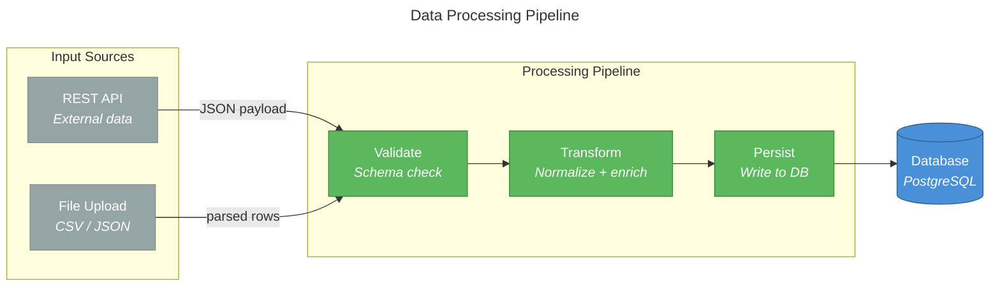
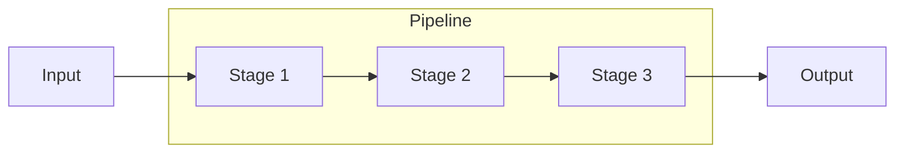
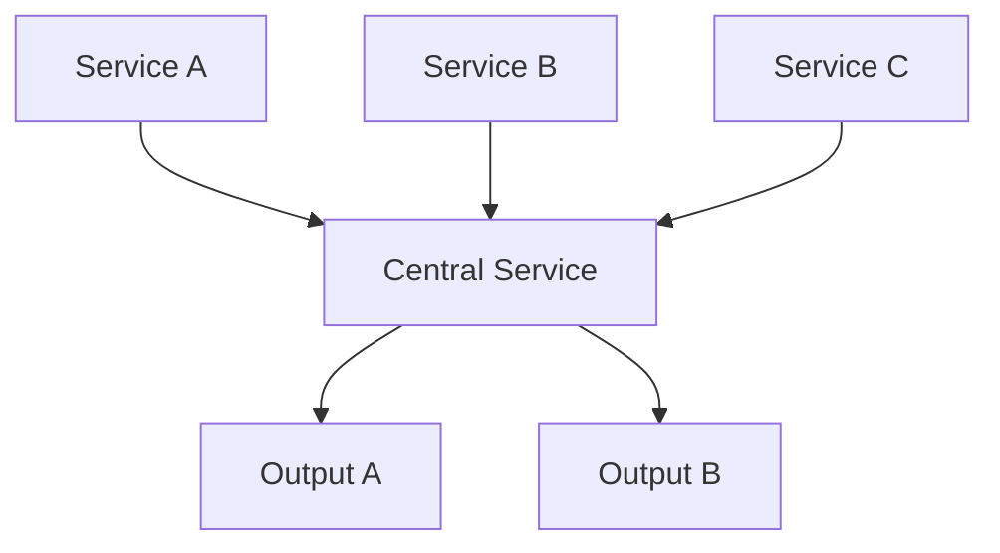
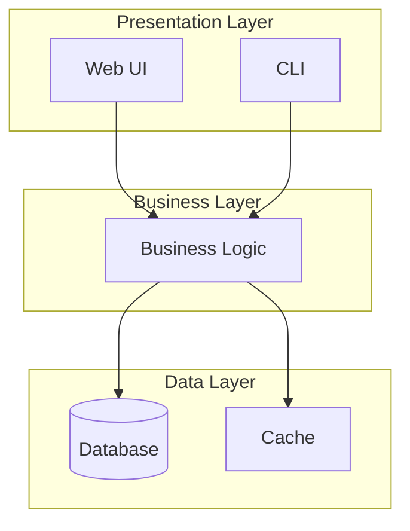
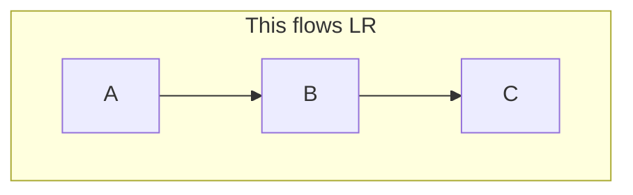

# Flowchart Reference

## When to Use

- Process flows and pipelines
- System architecture diagrams
- Decision trees and branching logic
- Layered architecture views
- Any diagram where C4/sequence/ERD/class/state isn't a better fit

Flowcharts are the most versatile Mermaid diagram type. When in doubt, use a
flowchart.

## Canonical Example



## Syntax Quick Reference

### Node Shapes

| Syntax | Shape | Use for |
|--------|-------|---------|
| `A["text"]` | Rectangle | General nodes |
| `A("text")` | Rounded rectangle | Processes, services |
| `A(["text"])` | Stadium | Start/end points |
| `A{"text"}` | Diamond | Decisions |
| `A[/"text"/]` | Parallelogram | I/O operations |
| `A[("text")]` | Cylinder (database) | Data stores |
| `A(("text"))` | Circle | Events, triggers |
| `A{{"text"}}` | Hexagon | Complex operations |
| `A>"text"]` | Asymmetric | Flags, signals |
| `A[[text]]` | Subroutine | Sub-process references |

### Edge Types

| Syntax | Style | Use for |
|--------|-------|---------|
| `-->` | Solid arrow | Primary data flow |
| `-.->` | Dashed arrow | Optional/secondary flow |
| `==>` | Thick arrow | Emphasis, critical path |
| `---` | Solid line (no arrow) | Association |
| `-.-` | Dashed line | Weak association |
| `-->\|"label"\|` | Labeled arrow | Describe what flows |

### Subgraph Syntax

```mermaid
subgraph Title["Display Title"]
    direction LR
    %% nodes here
end
```

- Subgraphs create visual grouping with a labeled boundary
- `direction` inside a subgraph overrides the parent graph's direction
- Subgraphs can be nested (limit to 2-3 levels)
- Edges can connect to/from subgraph IDs directly

## Common Patterns

### 1. Pipeline Pattern

Linear left-to-right processing stages:



### 2. Hub-and-Spoke Pattern

Central component connecting to multiple peripherals:



### 3. Layered Architecture Pattern

Top-to-bottom layers with clear boundaries:



## Pitfalls

### Subgraph Direction Inheritance

Inner subgraphs do NOT inherit the parent's direction. Always set `direction`
explicitly inside each subgraph:



### HTML in Labels

- Use `<br/>` for line breaks, `<b>` for bold, `<i>` for italic
- HTML labels require double-quote wrapping: `Node["<b>Title</b><br/>detail"]`
- Avoid complex HTML — keep labels simple
- `&amp;`, `&lt;`, `&gt;` for special characters

### Large Diagrams

- Over 25-30 nodes: split into multiple diagrams or use subgraph collapsing
- Prefer adding more subgraph structure over squeezing everything flat
- Increase `width` and `height` in `mermaid_preview` for dense diagrams
- Use section comments to keep source readable even when the diagram is large

### Unique Node IDs

Every node ID must be unique across the entire diagram, including across
subgraphs. Mermaid will silently merge nodes with duplicate IDs:

```
%% BAD — "Store" appears in two subgraphs, they merge
subgraph A
    Store["Doc Store"]
end
subgraph B
    Store["Vec Store"]    %% This is the SAME node!
end

%% GOOD — unique IDs
subgraph A
    DocStore["Doc Store"]
end
subgraph B
    VecStore["Vec Store"]
end
```
