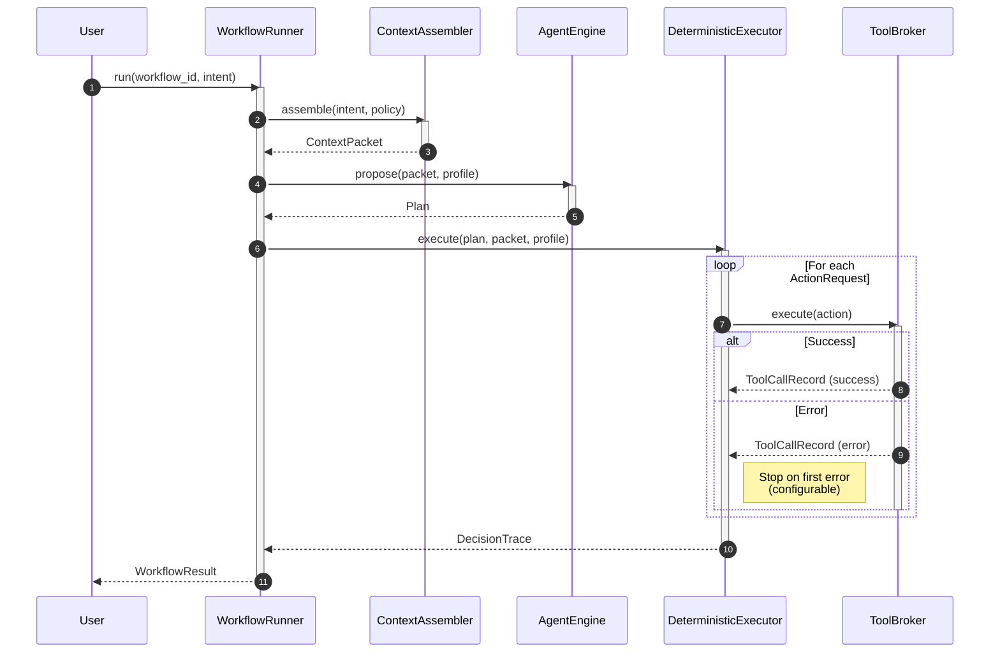
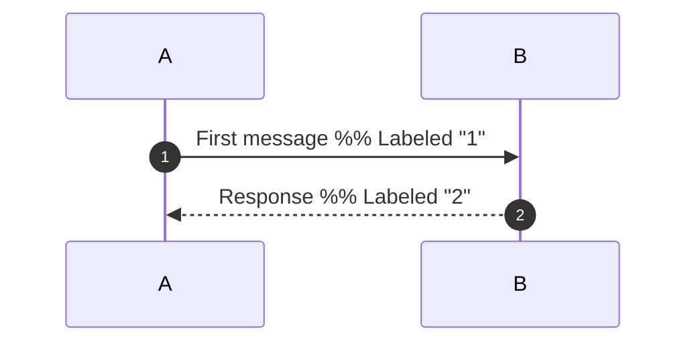
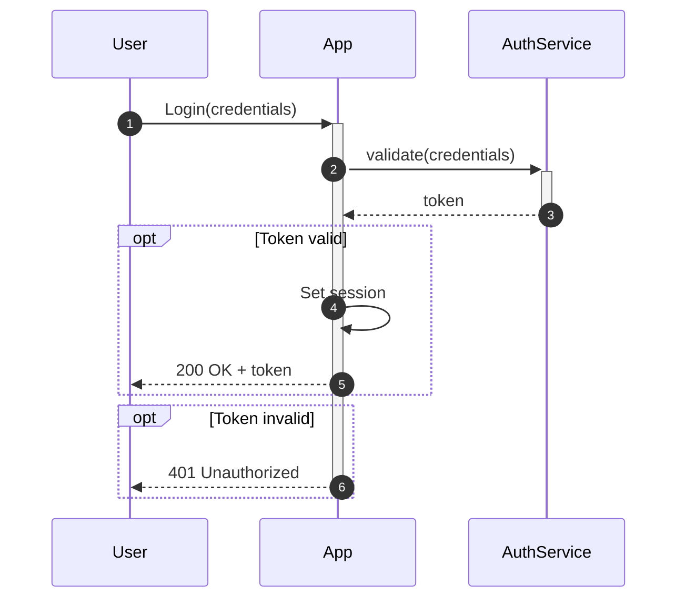
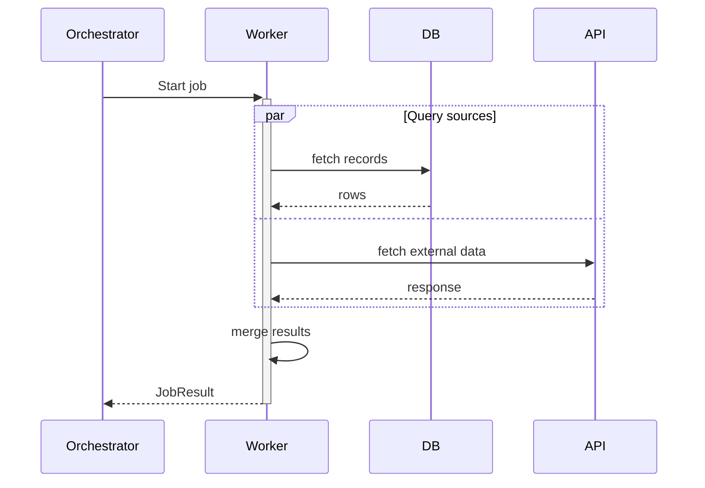
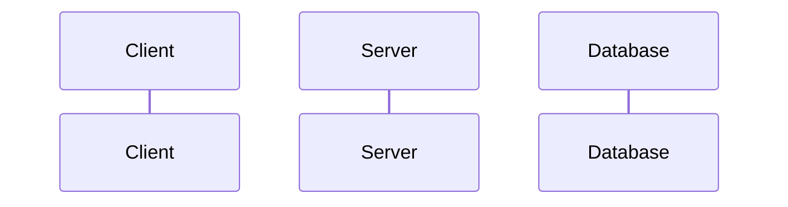

# Sequence Diagram Reference

## When to Use

- Temporal interactions between components or services
- API request/response flows
- Authentication and authorization sequences
- Multi-step protocols and handshakes
- Anything where the **order** of messages matters

## Canonical Example



## Syntax Quick Reference

### Participants

```mermaid
participant A as "Display Name"      %% Box participant
actor User                           %% Stick figure
```

- Declare participants at the top to control left-to-right ordering
- Use `as` aliases for shorter IDs in message lines
- `actor` renders as a stick figure (good for users/personas)

### Message Types

| Syntax | Style | Use for |
|--------|-------|---------|
| `->>` | Solid arrow | Synchronous request |
| `-->>` | Dashed arrow | Response / return |
| `--)` | Solid open arrow | Async message (fire-and-forget) |
| `--)`  | Dashed open arrow | Async response |
| `-x` | Solid with X | Failed / rejected message |
| `--x` | Dashed with X | Failed response |

### Activation Bars

```mermaid
activate A       %% Start activation bar
deactivate A     %% End activation bar

%% Or inline:
A->>+B: request  %% Activate B on send
B-->>-A: response  %% Deactivate B on return
```

### Grouping Blocks

```mermaid
%% Conditional
alt Condition A
    A->>B: do X
else Condition B
    A->>B: do Y
end

%% Optional
opt If condition
    A->>B: optional action
end

%% Loop
loop Every 5 minutes
    A->>B: poll
end

%% Parallel
par Task A
    A->>B: request 1
and Task B
    A->>C: request 2
end

%% Critical section
critical Establish connection
    A->>B: connect
option Timeout
    A->>A: retry
end
```

### Notes

```mermaid
Note right of A: Single participant note
Note over A,B: Spanning note across participants
Note left of A: Left-side note
```

### Autonumber

Add `autonumber` after the diagram type to auto-number all messages:



## Common Patterns

### 1. Request-Response with Error Handling

```mermaid
sequenceDiagram
    Client->>+API: POST /resource
    API->>+DB: INSERT
    alt Success
        DB-->>-API: row created
        API-->>-Client: 201 Created
    else Conflict
        DB-->>-API: duplicate key
        API-->>-Client: 409 Conflict
    end
```

### 2. Authentication Flow



### 3. Parallel Processing



## Pitfalls

### No `style` Directives

Sequence diagrams do **NOT** support `style` statements. This will cause a
parse error:

```
%% BAD — will break
style User fill:#1abc9c
```

Use participant aliases and clear naming instead of colors for differentiation.

### Participant Ordering

Participants render left-to-right in the order they are **declared** (not first
used). Always declare all participants at the top:



### Nested Block Depth

Mermaid supports nested `alt`/`loop`/`par` blocks, but deep nesting (3+
levels) becomes very hard to read. Prefer splitting into separate diagrams.

### Long Message Labels

Long message labels push participants apart. Keep labels to 3-5 words:

```
%% BAD
A->>B: Send the validated and transformed data payload to the persistence layer

%% GOOD
A->>B: persist(data)
```

### Activation Balance

Every `activate` needs a matching `deactivate`. Unbalanced activations cause
rendering errors. Use the inline `+`/`-` syntax for simple cases:

```mermaid
A->>+B: request
B-->>-A: response
```
