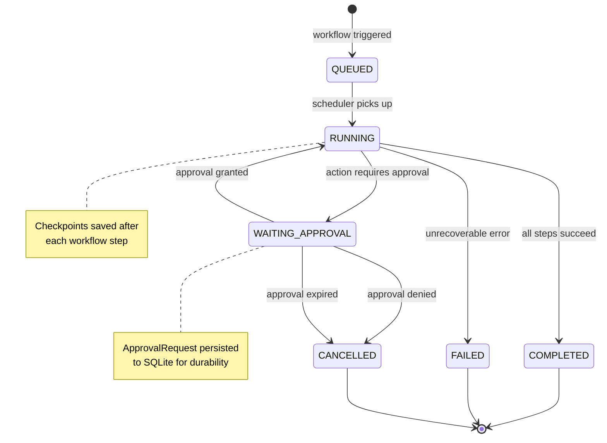
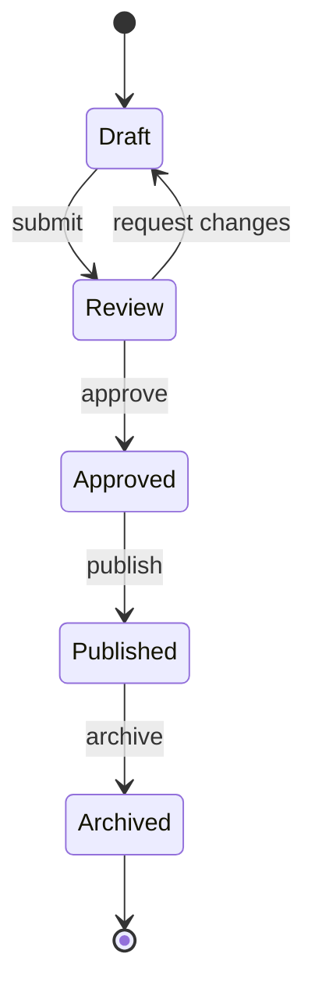
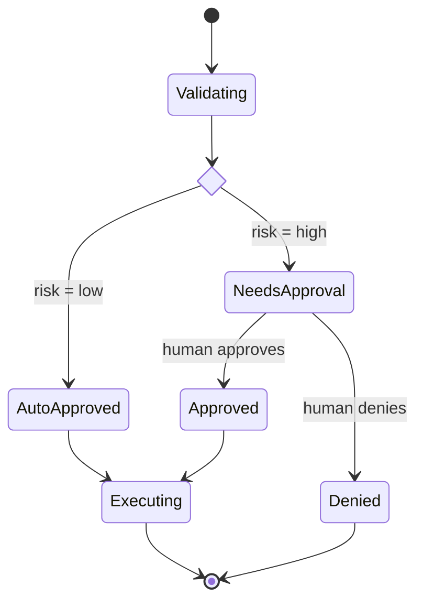
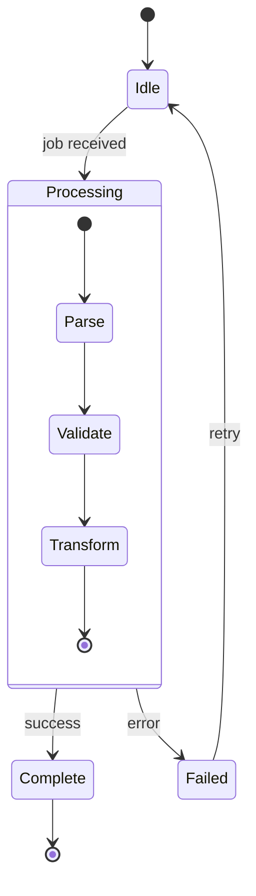

# State Diagram Reference

## When to Use

- Object lifecycle (e.g., WorkflowRun status transitions)
- Finite state machines (FSMs)
- Protocol states and transitions
- Approval/review workflows
- Any time you need to show "what states exist and how to move between them"

## Canonical Example

Using the project's `WorkflowRunStatus` as illustration:



## Syntax Quick Reference

### States

```mermaid
%% Simple state
StateA

%% State with description
state "Human-Readable Name" as StateA

%% Start and end
[*] --> FirstState       %% Start
LastState --> [*]        %% End
```

### Transitions

```mermaid
StateA --> StateB              %% Unlabeled transition
StateA --> StateB : event      %% Labeled transition
```

### Choice (Conditional Branching)

```mermaid
state check_result <<choice>>
Processing --> check_result
check_result --> Success : valid
check_result --> Failure : invalid
```

### Fork and Join (Parallel States)

```mermaid
state fork_state <<fork>>
state join_state <<join>>

Idle --> fork_state
fork_state --> TaskA
fork_state --> TaskB
TaskA --> join_state
TaskB --> join_state
join_state --> Done
```

### Composite States

```mermaid
state Running {
    [*] --> Assembling
    Assembling --> Planning
    Planning --> Executing
    Executing --> [*]
}
```

### Notes

```mermaid
note right of StateA
    Multi-line note
    about this state
end note

note left of StateB : Single-line note
```

### Direction

```mermaid
stateDiagram-v2
    direction LR    %% Left-to-right (default is TB)
```

## Common Patterns

### 1. Simple Lifecycle



### 2. Branching with Choice



### 3. Composite Sub-States



## Pitfalls

### State Naming

- State names cannot contain spaces or special characters in IDs
- Use the `state "Display Name" as ID` syntax for readable names:

```mermaid
state "Waiting for Approval" as WaitingApproval
```

### `[*]` Dual Purpose

`[*]` serves as both start and end state. Mermaid determines which based on
arrow direction:

```mermaid
[*] --> A     %% [*] is the START
A --> [*]     %% [*] is the END
```

You can have multiple end transitions but only one start point per diagram
(or per composite state).

### Composite Nesting Depth

Composite states can nest, but more than 2 levels becomes hard to read and
may render poorly. Prefer splitting into separate diagrams:

```
%% Acceptable: 2 levels
state Outer {
    state Inner {
        A --> B
    }
}

%% Avoid: 3+ levels
state L1 {
    state L2 {
        state L3 {    %% Too deep
            A --> B
        }
    }
}
```

### No Styling Support

Like ERD and sequence diagrams, state diagrams have limited styling options.
You cannot use `classDef`. States are rendered with the theme's default colors.
Use clear naming and notes for differentiation instead.

### Transition Labels

Keep transition labels to 1-3 words. Long labels make diagrams cluttered:

```
%% BAD
A --> B : the user clicks the submit button and the form validates

%% GOOD
A --> B : submit
```
