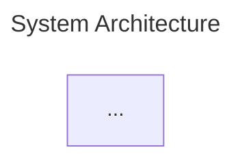

# Diagramming with Mermaid

This project uses **Mermaid** diagrams for architecture and design documentation, with live preview and export powered by the `claude-mermaid` MCP server.

---

## Setup

### Prerequisites

The `claude-mermaid` Node package is installed globally and configured as an MCP server:

```bash
# Install (already done)
npm install -g claude-mermaid

# Verify
claude-mermaid --version  # 1.4.0
```

### MCP Configuration

The MCP server is registered in `.mcp.json` at the project root:

```json
{
  "mcpServers": {
    "mermaid": {
      "type": "stdio",
      "command": "claude-mermaid",
      "args": [],
      "env": {}
    }
  }
}
```

This makes two tools available in every Claude Code session:

| Tool | Purpose |
|------|---------|
| `mermaid_preview` | Render a diagram and open live preview in browser |
| `mermaid_save` | Save the rendered diagram to a file on disk |

---

## The Mermaid Diagrams Skill

The project includes a Claude Code skill at `.claude/skills/mermaid-diagrams/` that provides expert guidance for creating diagrams. It is invoked automatically when Claude creates or edits Mermaid diagrams, or you can trigger it explicitly.

### Invoking the Skill

Ask Claude to create a diagram, or use the slash command:

```
/mermaid-diagrams
```

### What the Skill Provides

- **Diagram type selection** guidance (flowchart, C4, ERD, sequence, class, state)
- **Consistent color palette** with semantic class definitions (store, schema, engine, exec, etc.)
- **Best practices** for node naming, edge labels, subgraphs, and sizing
- **Reference files** for each diagram type in `.claude/skills/mermaid-diagrams/references/`

### Reference Files

| File | Covers |
|------|--------|
| `references/flowchart.md` | Node shapes, subgraphs, HTML labels, pipeline patterns |
| `references/sequence.md` | Participants, activations, loops, alt/opt, notes |
| `references/c4.md` | Context, Container, Component, Deployment diagrams |
| `references/erd.md` | Entities, attributes, crow's-foot cardinality |
| `references/class.md` | Visibility, stereotypes, relationships, generics |
| `references/state.md` | Transitions, fork/join, choice, composite states |

---

## Workflow

### 1. Create and Preview

Ask Claude to create a diagram. It will:

1. Write the Mermaid source code
2. Call `mermaid_preview` to render it in your browser with live reload
3. Iterate on the diagram based on visual feedback

```
"Create an architecture diagram of the memory subsystem"
```

The preview opens in your default browser and auto-refreshes when the diagram is updated.

### 2. Refine

Ask for changes — Claude will update the source and the browser preview refreshes automatically:

```
"Add the context graph layer"
"Use LR direction for the pipeline section"
"Highlight the critical path in red"
```

### 3. Save

Once the diagram looks right, ask Claude to save it:

```
"Save this diagram to docs/diagrams/"
```

Claude will:
- Save the rendered output (SVG/PNG) via `mermaid_save`
- Save the `.mmd` source file alongside it for future editing

### Output Formats

| Format | Best For |
|--------|----------|
| SVG (default) | Documentation, web, scalable |
| PNG | Presentations, README embeds |
| PDF | Print, formal documents |

---

## Conventions

### File Locations

| Path | Contents |
|------|----------|
| `docs/diagrams/*.mmd` | Mermaid source files |
| `docs/diagrams/*.svg` | Rendered SVG output |
| `docs/diagrams/*.png` | Rendered PNG output |

### Source File Format

All `.mmd` files should include YAML front matter:



### Color Palette

The skill defines a standard set of semantic color classes. Use these consistently:

| Class | Color | Use For |
|-------|-------|---------|
| `store` | Blue | Data stores, databases, persistence |
| `schema` | Amber | Schemas, contracts, data models |
| `engine` | Purple | Processing engines, LLM, compute |
| `exec` | Red | Execution, validation, enforcement |
| `ingest` | Green | Ingestion, input, import pipelines |
| `runner` | Violet | Orchestration, workflow runners |
| `external` | Gray | External/third-party systems |
| `user` | Teal | Users, personas, actors |

Apply with `classDef` and `class` statements at the end of the diagram:

```
classDef store fill:#4a90d9,stroke:#2c5f8a,color:#fff
classDef schema fill:#e8a838,stroke:#b8832c,color:#fff

class DocStore,VecStore,GraphStore store
class ContextPacket,Plan schema
```

### Direction Guidelines

| Direction | When |
|-----------|------|
| `TB` (top-to-bottom) | Architecture diagrams, hierarchies, layers |
| `LR` (left-to-right) | Pipelines, timelines, sequential processes |

---

## Existing Diagrams

| Diagram | Source | Description |
|---------|--------|-------------|
| Data Flow Pipeline | `docs/diagrams/memory-system-data-flow.mmd` | Sources → ingestion → memory stores → context assembly → ContextPacket |
| Workflow Execution Cycle | `docs/diagrams/memory-system-execution.mmd` | WorkflowRunner → engines → executor → DecisionTrace |
| Feedback & Learning Loop | `docs/diagrams/memory-system-feedback.mmd` | Traces → graph decomposition → experience learning → next run |
| System Context | `docs/diagrams/context-graph-system-context.mmd` | System-level view: consumers, kernel, stores, sources, peers |
| Container View | `docs/diagrams/context-graph-container.mmd` | Internal components: write path, read path, maintenance |
| Node Type Catalog | `docs/diagrams/context-graph-ontology-nodes.mmd` | All 30+ node types grouped by category |
| Episodic Memory | `docs/diagrams/context-graph-ontology-episodic.mmd` | Trace decomposition into trajectories and decision events |
| Knowledge Relationships | `docs/diagrams/context-graph-ontology-knowledge.mmd` | Semantic memory and business entity relationships |
| Braintrust Integration | `docs/diagrams/context-graph-braintrust.mmd` | Knowledge IN (context graph) vs Evaluation OUT (Braintrust) |
| Process Map | `docs/diagrams/context-graph-process-map.mmd` | P0-P6 agent execution pipeline |
| Capability Map | `docs/diagrams/context-graph-capabilities.mmd` | C1-C10 capability model |
| Distillation Pipeline | `docs/diagrams/context-graph-distillation.mmd` | Traces → knowledge distillation → insights/patterns |
| Retrieval Pipeline | `docs/diagrams/context-graph-retrieval.mmd` | Memory stores → retrieval strategies → ContextPacket |

To edit an existing diagram:

```
"Load docs/diagrams/context-graph-system-context.mmd and preview it"
```

---

## Troubleshooting

### Preview doesn't open

Ensure `claude-mermaid` is installed globally and accessible:

```bash
which claude-mermaid
```

If WSL2, the browser opens on the Windows host via `wslview` or similar.

### Syntax errors in preview

Mermaid rendering has quirks. Common issues:
- **Special characters in labels** need quoting: `["Label with (parens)"]`
- **`style` directives don't work in sequence diagrams** — use `classDef` instead
- **Subgraph IDs** can't contain spaces — use `subgraph MyGroup["My Group"]`

### MCP server not connecting

Check `.mcp.json` is at the project root and restart Claude Code:

```bash
cat .mcp.json
# Should show the mermaid server config
```
