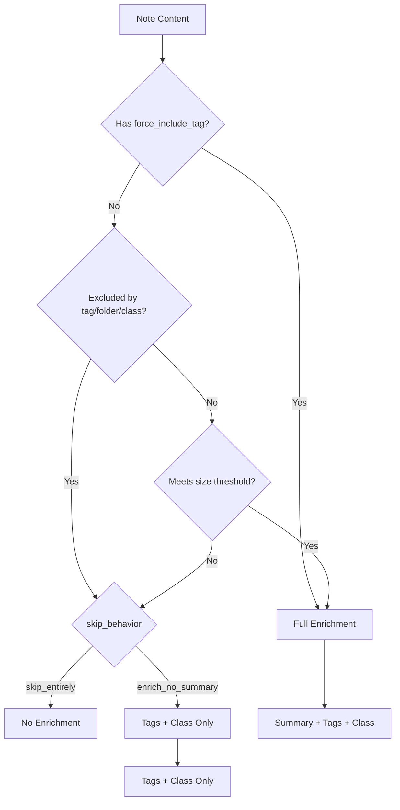

# 15. Auto-Tagging & Entity Enrichment (v1.0.5)

## Overview

Auto-tagging uses LLM analysis to generate metadata, stored in a separate `auto:` namespace. This keeps human-authored content distinct from machine-generated suggestions.

**v1.0.5 Updates**:
- Added summarization thresholds to control when summaries are generated
- **Generalized to Universal Entity Model**: Enrichment now works with any entity type (notes, Slack messages, emails, etc.) using source-specific prompts
- Introduced `SourceEnrichmentConfig` for per-source customization
- Added `EnrichmentConfigRegistry` for YAML-based configuration

---

## Design Principles

### 1. Human vs. Machine Separation

```yaml
# Human-authored (never touched by LLM)
tags: [project/agent-system, meeting]

# Machine-generated (auto: namespace)
auto:
  tags: [architecture, planning, ai-ml]
  class: meeting
  summary: "Discussion of agent architecture..."
```

### 2. Non-Destructive

- Auto-tagging **never** modifies human content
- Only writes to `auto:` namespace
- Can always be regenerated from content
- Safe for automatic application (no approval needed)

### 3. Graph Integration

Both human and auto-tags are wired into the knowledge graph:

| Tag Type | Frontmatter | Graph Edge Property |
|----------|-------------|---------------------|
| Human | `tags: [...]` | `source: "human"` |
| Auto | `auto.tags: [...]` | `source: "auto"` |

---

## Architecture

```
┌─────────────────────────────────────────────────────────────────────────┐
│                         AUTO-TAGGING PIPELINE                           │
├─────────────────────────────────────────────────────────────────────────┤
│                                                                         │
│  1. NOTE CONTENT                                                        │
│     └── Title + Body + Existing Tags                                    │
│                                                                         │
│  2. LLM ANALYSIS (EnrichmentService)                                    │
│     └── Prompt: "Analyze this note and suggest metadata..."             │
│     └── Model: gpt-4o-mini (configurable)                               │
│     └── Output: JSON with tags, class, summary, confidence              │
│                                                                         │
│  3. FRONTMATTER INJECTION (_inject_auto_fields)                         │
│     └── Parse existing YAML                                             │
│     └── Update `auto:` namespace only                                   │
│     └── Check file hasn't changed (writeback safety)                    │
│     └── Write updated content                                           │
│                                                                         │
│  4. GRAPH WIRING                                                        │
│     └── Create tag nodes (upsert)                                       │
│     └── Create note→tag edges with source="auto"                        │
│     └── Delete stale auto-tag edges                                     │
│                                                                         │
└─────────────────────────────────────────────────────────────────────────┘
```

---

## Components

### EnrichmentService

Located: `src/agent_kernel/services/enrichment.py`

```python
class EnrichmentService:
    """LLM-powered metadata generation for notes."""
    
    async def enrich(
        self,
        content: str,
        title: str = "",
        existing_tags: list[str] | None = None,
        include_summary: bool = True,  # v1.0.5
    ) -> EnrichmentResult:
        """Generate auto-tags, classification, and optionally summary.
        
        Args:
            content: Note content (markdown).
            title: Note title.
            existing_tags: Existing human-authored tags.
            include_summary: Whether to generate summary (v1.0.5).
        """
```

#### EnrichmentResult

```python
@dataclass
class EnrichmentResult:
    auto_tags: list[str]        # e.g., ["architecture", "planning"]
    auto_class: str | None      # e.g., "meeting"
    auto_summary: str | None    # e.g., "Discussion of..."
    tag_confidence: float       # 0.0 - 1.0
    class_confidence: float     # 0.0 - 1.0
    success: bool
    error: str | None
```

### Default Classifications

The LLM classifies notes into one of these categories:

```python
DEFAULT_CLASSIFICATIONS = [
    "meeting",
    "architecture", 
    "reference",
    "journal",
    "project",
    "brainstorm",
    "documentation",
    "task-list",
    "research",
    "notes",
]
```

---

## LLM Prompts

### System Prompt

```
You are an expert at analyzing notes and documents to suggest metadata.

Your task is to analyze the content and suggest:
1. **Tags**: 2-5 relevant topic tags (lowercase, hyphenated)
2. **Classification**: A single category that best describes the note type
3. **Summary**: A brief 1-sentence summary (optional, only if the note is long)

Available classifications: meeting, architecture, reference, ...

IMPORTANT RULES:
- Tags should be general topics, not specific to the note content
- Use existing tag patterns if the note has human tags
- Classification must be from the provided list
- Summary should capture the main purpose/topic
- Be conservative - only suggest high-confidence tags

Respond in JSON format:
{
  "tags": ["tag1", "tag2"],
  "class": "classification",
  "summary": "Brief summary if note is long, null otherwise",
  "tag_confidence": 0.85,
  "class_confidence": 0.90
}
```

### User Prompt

```
Analyze this note and suggest metadata:

---
Title: {title}
Existing tags: {existing_tags}
---

{content}

---

Respond with JSON only, no markdown formatting.
```

---

## Frontmatter Structure

### Before Enrichment

```yaml
---
id: note_01J...
tags: [project/agent-system, meeting]
---

# Meeting Notes
...
```

### After Enrichment

```yaml
---
id: note_01J...
tags: [project/agent-system, meeting]
auto:
  tags:
  - architecture
  - planning
  - ai-ml
  class: meeting
  summary: Discussion of agent architecture and planning decisions.
---

# Meeting Notes
...
```

---

## Graph Integration

### Edge Properties

| Property | Human Tags | Auto Tags |
|----------|------------|-----------|
| `edge_type` | `note_tagged_with_tag` | `note_tagged_with_tag` |
| `source` | `"human"` | `"auto"` |
| `confidence` | `1.0` | LLM confidence (0.0-1.0) |
| `extracted_by` | `"vault_indexer"` | `"enrichment_service"` |

### Stale Edge Deletion

When a note is re-indexed:

1. **Human tags**: Compare current `tags:` to existing edges with `source="human"`
2. **Auto tags**: Compare current `auto.tags` to existing edges with `source="auto"`
3. **Delete**: Edges where target is no longer in the respective tag list

This ensures:
- Removed human tags → edges deleted
- Changed auto-tags → old edges deleted, new edges created
- Human and auto edges are managed independently

---

## CLI Commands

### Vault Sync with Enrichment

```bash
# Sync + enrich all notes
agent-kernel obsidian-sync --with-enrichment

# Force re-enrich (even if already has auto: section)
agent-kernel obsidian-sync --force --with-enrichment

# Specific folder
agent-kernel obsidian-sync --folder "03-Projects" --with-enrichment

# Summarize all notes (override thresholds)
agent-kernel obsidian-sync --with-enrichment --summarize-all
```

### Options

| Option | Description |
|--------|-------------|
| `--with-enrichment` | Enable LLM enrichment (auto.* fields) |
| `--enrichment-model` | LLM model (default: gpt-4o-mini) |
| `--force`, `-f` | Re-index even if unchanged (re-enrich) |
| `--folder` | Specific folder to process |
| `--summarize-all` | Override thresholds and summarize all notes |
| `--summarization-skip` | Override skip behavior (`skip_entirely` \| `enrich_no_summary`) |

---

## Configuration

### Environment Variables

```bash
# Required
OPENAI_API_KEY=sk-...

# Optional (set in .env or config)
OBSIDIAN_VAULT_PATH=/path/to/vault
```

### Enrichment Config

```yaml
# configs/enrichment.yaml
enrichment:
  model: gpt-4o-mini
  temperature: 0.3
  max_content_length: 4000
  classifications:
    - meeting
    - architecture
    - reference
    - journal
    - project
    - brainstorm
    - documentation
    - task-list
    - research
    - notes
  tag_rules:
    min_tags: 2
    max_tags: 5
    use_existing_patterns: true
```

---

## Summarization Thresholds (v1.0.5)

Not all notes need summaries. Short notes, daily journals, and private content can skip summarization to save API costs while still getting tags and classification.

### Configuration Schema

```python
class SummarizationConfig(BaseModel):
    """Configuration for when to generate summaries."""
    
    # Size thresholds (0 = disabled)
    min_char_count: int = 500
    min_word_count: int = 100
    
    # Type exclusions
    excluded_classifications: list[str] = ["journal", "daily-note"]
    excluded_folders: list[str] = ["Daily Notes/", "Journal/"]
    excluded_tags: list[str] = ["no-summary", "private"]
    
    # Force include (overrides exclusions)
    force_include_tags: list[str] = ["summarize", "important"]
    
    # Behavior when excluded
    skip_behavior: Literal["skip_entirely", "enrich_no_summary"] = "enrich_no_summary"
```

### Environment Variables

```bash
# .env configuration

# Size thresholds
SUMMARIZATION_MIN_CHARS=500
SUMMARIZATION_MIN_WORDS=100

# Exclusions (comma-separated)
SUMMARIZATION_EXCLUDED_FOLDERS=Daily Notes/,Journal/
SUMMARIZATION_EXCLUDED_TAGS=no-summary,private
SUMMARIZATION_EXCLUDED_CLASSIFICATIONS=journal,daily-note

# Force include (overrides exclusions)
SUMMARIZATION_FORCE_INCLUDE_TAGS=summarize,important

# Behavior: skip_entirely | enrich_no_summary
SUMMARIZATION_SKIP_BEHAVIOR=enrich_no_summary
```

### Skip Behaviors

| Behavior | Tags/Class | Summary | Use Case |
|----------|------------|---------|----------|
| `enrich_no_summary` | ✅ Generated | ❌ Skipped | Most cases: get metadata, skip expensive summary |
| `skip_entirely` | ❌ Skipped | ❌ Skipped | Truly private/excluded content |

### Decision Flow



### CLI Options

```bash
# Use config from .env
agent-kernel vault-sync --with-enrichment

# Override: summarize everything (ignore thresholds)
agent-kernel vault-sync --with-enrichment --summarize-all

# Override skip behavior
agent-kernel vault-sync --with-enrichment --summarization-skip skip_entirely
```

### Priority Order

1. **Force include tags** (highest): `summarize`, `important` → always summarize
2. **Excluded tags**: `no-summary`, `private` → skip based on behavior
3. **Excluded folders**: `Daily Notes/`, `Journal/` → skip based on behavior
4. **Excluded classifications**: `journal`, `daily-note` → skip based on behavior
5. **Size thresholds**: `min_char_count`, `min_word_count` → skip if below

---

## Cost Considerations

### Per-Note Cost (gpt-4o-mini)

| Metric | Value |
|--------|-------|
| Input tokens | ~300-500 |
| Output tokens | ~50-100 |
| Cost per note | ~$0.0001 |

### Batch Processing

| Notes | Estimated Cost |
|-------|----------------|
| 100 | ~$0.01 |
| 1,000 | ~$0.10 |
| 10,000 | ~$1.00 |

### Optimization Tips

1. **Use `--limit`** for testing before full vault enrichment
2. **Skip already-enriched** notes (default behavior)
3. **Use `--folder`** to target specific areas
4. **Batch during sync** rather than running separately

---

## Writeback Safety

The `_inject_auto_fields` method includes several safety measures:

1. **File modification check**: Compares `mtime` before and after reading
2. **YAML preservation**: Parses and reconstructs YAML safely
3. **Namespace isolation**: Only touches `auto:` key
4. **Error handling**: Graceful failure without corruption

```python
# Writeback safety check
original_mtime = full_path.stat().st_mtime
# ... read and process ...
current_mtime = full_path.stat().st_mtime
if current_mtime != original_mtime:
    logger.warning("auto_fields_injection_aborted_file_changed")
    return False
```

---

## Integration with Embedding Strategy

Auto-tagging is **Phase 2** of the hierarchical embedding strategy:

| Phase | Component | Status |
|-------|-----------|--------|
| 1 | Graph + Documents | ✅ Complete |
| 2 | Auto-Tagging | ✅ Complete |
| 3 | Summary Generation | ✅ Complete (with thresholds) |
| 4 | Hierarchical Embeddings | ✅ Complete |
| 5 | Hybrid Search | ✅ Complete |

The `auto.summary` field generated during enrichment is used for summary embeddings. With summarization thresholds (v1.0.5), notes that don't meet size/type criteria skip summary generation but can still get tags and classification.

---

## Troubleshooting

### Notes Not Getting Enriched

1. Check `OPENAI_API_KEY` is set
2. Check note doesn't already have `auto:` section (use `--force`)
3. Check for errors in output logs

### Auto-Tags Not in Graph

1. Run `vault-sync` after `enrich` command
2. Or use `vault-sync --with-enrichment` for combined operation

### Wrong Classifications

1. Customize `classifications` list in config
2. Adjust `temperature` (lower = more consistent)
3. Review and update prompt for your domain

---

---

## Universal Entity Enrichment (v1.0.5)

The enrichment system has been generalized to work with any entity type, not just Obsidian notes. Each source (Obsidian, Slack, Outlook, etc.) can have its own configuration with customized prompts and thresholds.

### Source Configuration Structure

```python
class SourceEnrichmentConfig(BaseModel):
    """Enrichment configuration for a specific source type."""
    
    source_id: str                    # obsidian, slack, outlook, etc.
    entity_types: list[str]           # note, message, email, etc.
    
    # Prompts
    system_prompt: str                # LLM system prompt
    user_prompt_template: str         # User prompt with placeholders
    
    # Output schema
    extract_summary: bool = True
    extract_tags: bool = True
    extract_classification: bool = True
    classifications: list[str] = []
    
    # LLM settings
    model: str | None = None
    temperature: float = 0.3
    max_content_length: int = 4000
    
    # Thresholds
    thresholds: EnrichmentThresholds
```

### YAML Configuration

Source configs are loaded from `configs/enrichment/*.yaml`:

```yaml
# configs/enrichment/obsidian.yaml
source_id: obsidian
entity_types: [note, document]

system_prompt: |
  You are an expert at analyzing notes...
  Consider [[wiki-links]] as relationships...

classifications:
  - meeting
  - architecture
  - reference
  - journal

thresholds:
  min_char_count: 500
  excluded_paths: ["Daily Notes/", "Journal/"]
  skip_behavior: enrich_no_summary
```

### Adding New Sources

To add enrichment for a new source (e.g., Slack):

1. Create `configs/enrichment/slack.yaml`:

```yaml
source_id: slack
entity_types: [message, thread]

system_prompt: |
  You are analyzing a Slack conversation thread.
  Focus on: decisions made, action items, key topics.
  ...

classifications:
  - discussion
  - decision
  - announcement
  - question

thresholds:
  min_char_count: 200  # Slack messages are shorter
  skip_behavior: enrich_no_summary
```

2. The registry will automatically load it on startup.

3. Use `enrich_entity()` with an `EntityRef`:

```python
entity_ref = EntityRef(
    source_id="slack",
    entity_type="message",
    entity_id="C123-1234567890.123456"
)

result = await enrichment_service.enrich_entity(
    content=message_content,
    entity_ref=entity_ref,
    config_registry=registry,
)
```

### EnrichmentConfigRegistry

```python
from agent_kernel.services.enrichment_registry import get_enrichment_registry

# Get global registry (loads from configs/enrichment/)
registry = get_enrichment_registry()

# Get config for a source
config = registry.get("obsidian")

# Get with fallback
config = registry.get_or_default("slack")

# List all sources
sources = registry.list_sources()
```

### Backwards Compatibility

- `SummarizationConfig` is now an alias for `EnrichmentThresholds`
- `EnrichmentService.enrich()` still works for note-only use cases
- `EnrichmentService.enrich_entity()` is the new generalized method

---

## References

- [Enrichment Service](../../src/agent_kernel/services/enrichment.py)
- [Enrichment Registry](../../src/agent_kernel/services/enrichment_registry.py)
- [Vault Indexer](../../src/agent_kernel/services/vault_indexer.py)
- [SourceEnrichmentConfig Schema](../../src/agent_kernel/core/schemas/enrichment_config.py)
- [Obsidian Config](../../configs/enrichment/obsidian.yaml)
- [Integration Patterns](./12-integration-patterns.md)
- [Embedding Strategy](./14-embedding-strategy.md)
- [Universal Context System](./17-universal-context-system.md)
