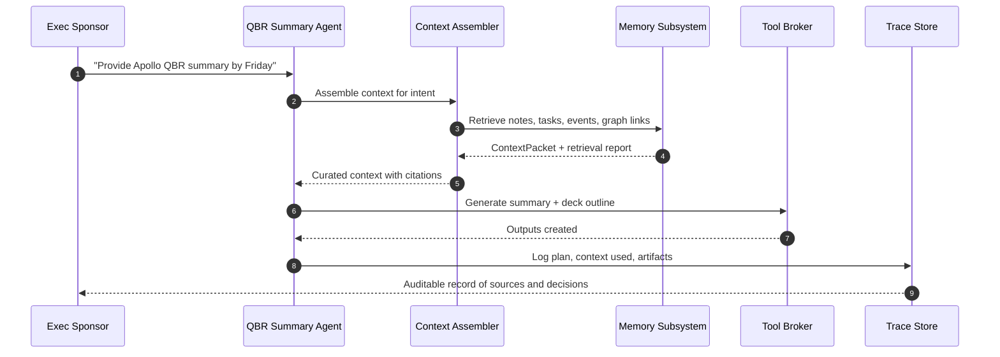

# Leadership Diagrams: Memory, Context Graph, Context Management

These Mermaid diagrams are designed for a leadership narrative on durable,
standardized systems for long-term agent value.

## Separate Diagram Files

- `docs/design/leadership-diagram-legend.md`
- `docs/design/leadership-diagram-memory.md`
- `docs/design/leadership-diagram-context-management.md`
- `docs/design/leadership-diagram-context-graph.md`
- `docs/design/leadership-diagram-entity-graph.md`
- `docs/design/leadership-diagram-agent-behavior.md`

## Color Legend

```mermaid
flowchart LR
  L1[Sources]:::source --> L2[Memory System]:::memory --> L3[Context Mgmt]:::context --> L4[Agent/Outputs]:::agent
  L5[Graph/Relations]:::graph --- L2
  L6[Governance]:::governance --- L3

  classDef source fill:#f4f4f4,stroke:#999999,color:#111111;
  classDef memory fill:#dbeafe,stroke:#2563eb,color:#0f172a;
  classDef context fill:#dcfce7,stroke:#16a34a,color:#052e16;
  classDef graph fill:#fef9c3,stroke:#ca8a04,color:#3f2a00;
  classDef governance fill:#ffedd5,stroke:#ea580c,color:#7c2d12;
  classDef agent fill:#ede9fe,stroke:#7c3aed,color:#2e1065;
```

## 1) Memory Management (Standardized Storage)

```mermaid
flowchart LR
  subgraph Sources
    S1[Notes]:::source
    S2[Tasks]:::source
    S3[Calendar]:::source
    S4[Email/Slack]:::source
  end

  subgraph MemorySubsystem[Memory Subsystem]
    D1[Document Store]:::memory
    V1[Vector Index]:::memory
    G1[Context Graph Store]:::graph
    E1[Entity Store]:::memory
    L1[Event Log]:::memory
    X1[Experience Store]:::memory
    I1[Index State Store]:::governance
  end

  MC[Memory Coordinator]:::context

  S1 --> D1
  S2 --> D1
  S3 --> D1
  S4 --> D1

  D1 --> V1
  D1 --> G1
  D1 --> E1
  D1 --> L1
  L1 --> X1
  D1 --> I1
  G1 --> I1
  V1 --> I1

  D1 --> MC
  V1 --> MC
  G1 --> MC
  E1 --> MC
  L1 --> MC
  X1 --> MC

  classDef source fill:#f4f4f4,stroke:#999999,color:#111111;
  classDef memory fill:#dbeafe,stroke:#2563eb,color:#0f172a;
  classDef context fill:#dcfce7,stroke:#16a34a,color:#052e16;
  classDef graph fill:#fef9c3,stroke:#ca8a04,color:#3f2a00;
  classDef governance fill:#ffedd5,stroke:#ea580c,color:#7c2d12;
```

## 2) Context Management (Deterministic Assembly + Governance)

```mermaid
flowchart LR
  I[Business Intent\n"Prepare QBR for Apollo"]:::source --> A[Context Assembler]:::context
  P[Context Policy\n(budgets, scope, redaction)]:::governance --> A
  Q[Quality Gates\n(coverage, recency, playbook)]:::governance --> A

  A --> R[ContextPacket\n(items + graph slice + report)]:::context

  subgraph RetrievalSources[Retrieval Sources]
    D[Document Store]:::memory
    V[Vector Index]:::memory
    G[Context Graph]:::graph
    T[Open Tasks]:::memory
    C[Upcoming Events]:::memory
    X[Experience Memory]:::memory
  end

  A --> D
  A --> V
  A --> G
  A --> T
  A --> C
  A --> X

  R --> AG[Agent Engine]:::agent --> EX[Executor + Tool Broker]:::agent
  EX --> OUT[Artifacts\n(summary, plan, report)]:::agent
  EX --> TR[Decision Trace]:::memory

  classDef source fill:#f4f4f4,stroke:#999999,color:#111111;
  classDef memory fill:#dbeafe,stroke:#2563eb,color:#0f172a;
  classDef context fill:#dcfce7,stroke:#16a34a,color:#052e16;
  classDef graph fill:#fef9c3,stroke:#ca8a04,color:#3f2a00;
  classDef governance fill:#ffedd5,stroke:#ea580c,color:#7c2d12;
  classDef agent fill:#ede9fe,stroke:#7c3aed,color:#2e1065;
```

## 3) Context Graph Relationships (Concrete Example)

```mermaid
flowchart LR
  P1[Project: Apollo Expansion]:::graph
  N1[Note: 2026-01-15 QBR Notes]:::graph
  T1[Task: Draft QBR deck]:::graph
  E1[Event: QBR with Exec Team\n2026-02-03]:::graph
  U1[Person: Avery (Sales Lead)]:::graph
  D1[Decision: "Standardize pricing tiers"]:::graph
  PB1[Playbook: QBR Prep v2]:::graph
  TR1[Trace: QBR Agent Run]:::graph

  N1 -- "note_links_to_note" --> P1
  T1 -- "task_belongs_to_project" --> P1
  E1 -- "entity_related_to" --> P1
  U1 -- "entity_related_to" --> P1
  D1 -- "entity_related_to" --> P1

  TR1 -- "trace_used_context" --> N1
  TR1 -- "trace_used_context" --> T1
  TR1 -- "trace_used_context" --> E1
  TR1 -- "trace_used_context" --> PB1
  TR1 -- "trace_produced_artifact" --> D1

  classDef graph fill:#fef9c3,stroke:#ca8a04,color:#3f2a00;
```

## 3b) Context Graph Entities + Edges (EntityRef Example)

```mermaid
flowchart LR
  subgraph EntityNodes[Entity Nodes (EntityRef)]
    EN1["ent_01ABC\nsource=obsidian\ntype=note\nid=apollo_qbr_2026_01_15"]:::graph
    EN2["ent_01DEF\nsource=tasks\ntype=task\nid=task_8842"]:::graph
    EN3["ent_01GHI\nsource=calendar\ntype=event\nid=evt_5521"]:::graph
    EN4["ent_01JKL\nsource=slack\ntype=message\nid=C123-4567"]:::graph
    EN5["ent_01MNO\nsource=github\ntype=pull_request\nid=PR-218"]:::graph
    EN6["ent_01PQR\nsource=crm\ntype=account\nid=acct_apollo"]:::graph
  end

  subgraph EdgeTypes[Edge Types]
    E1["task_belongs_to_project"]:::graph
    E2["entity_related_to"]:::graph
    E3["trace_used_context"]:::graph
  end

  EN2 -- "task_belongs_to_project" --> EN6
  EN1 -- "entity_related_to" --> EN6
  EN3 -- "entity_related_to" --> EN6
  EN4 -- "entity_related_to" --> EN1
  EN5 -- "entity_related_to" --> EN6

  TR["trace_01STU\nQBR Agent Run"]:::graph -- "trace_used_context" --> EN1
  TR -- "trace_used_context" --> EN2
  TR -- "trace_used_context" --> EN3

  classDef graph fill:#fef9c3,stroke:#ca8a04,color:#3f2a00;
```

## 4) Agent Behavior Example (One Concrete Story)



### Example behavior embedded in the diagram
- Intent: "Provide Apollo QBR summary by Friday"
- Retrieved items: QBR notes, open tasks, upcoming exec meeting, project relationships
- Outcome: Summary + deck outline with citations and an auditable trace
