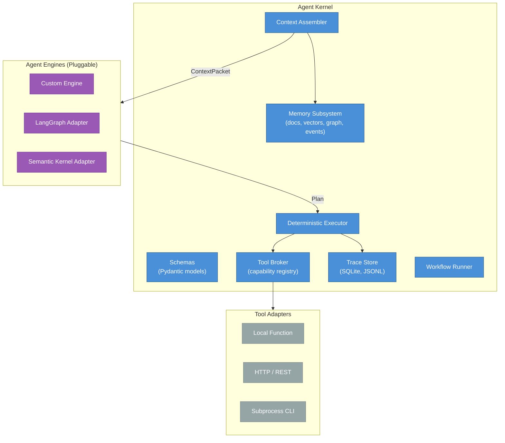
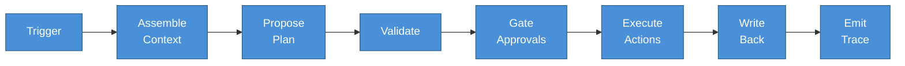
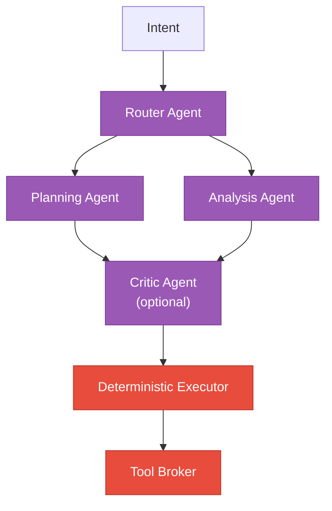

# Architecture Guide

Agent Kernel is a framework-agnostic foundation for AI agent systems. This guide covers the system architecture, data flow, component responsibilities, and multi-agent patterns.

## Design Principles

Four principles govern every component:

1. **Schemas are the contract** -- all data flows through typed Pydantic models
2. **Separation of reasoning vs. execution** -- LLMs produce Plans; a deterministic executor runs tools
3. **Kernel owns memory and traces** -- agent frameworks never own data or control the audit trail
4. **Adapters everywhere** -- swap any external dependency behind an interface

## System Components



### Kernel Components

| Component | Responsibility |
|-----------|---------------|
| **Schemas** | Typed Pydantic models for all data contracts |
| **Memory Subsystem** | Document store, vector index, graph store, event log |
| **Tool Broker** | Capability registry, input validation, execution gateway |
| **Context Assembler** | Deterministic context retrieval into `ContextPacket` |
| **Deterministic Executor** | Plan validation, approval gating, tool execution |
| **Trace Store** | Immutable audit trail with pluggable sinks |
| **Workflow Runner** | State machine for multi-step execution flows |

### Agent Engines

An engine is anything that turns a `ContextPacket` + `AgentProfile` into a `Plan`:

```python
class AgentEngine(Protocol):
    engine_id: str

    async def propose(
        self,
        context_packet: ContextPacket,
        agent_profile: AgentProfile,
    ) -> Plan: ...
```

The kernel does not care which engine produced the plan, as long as it validates against the schema.

### Tool Adapters

Tools execute behind the broker through adapters:

| Adapter | Description |
|---------|-------------|
| **Local Function** | Direct Python function call |
| **HTTP** | REST API calls to external services |
| **Subprocess** | Shell command execution |

## Data Flow

A single workflow execution follows this pipeline:



### Step by Step

1. **Trigger** -- a cron schedule, file change, event, or manual invocation starts the workflow
2. **Assemble Context** -- the Context Assembler queries memory stores (documents, vectors, graph) and builds a `ContextPacket` within budget limits
3. **Propose Plan** -- the selected Agent Engine receives the context packet and produces a structured `Plan` with actions, citations, and risk assessment
4. **Validate** -- the executor checks schema validity, citation requirements, capability allowlists, and idempotency keys
5. **Gate Approvals** -- actions requiring approval are blocked until a human approves via CLI or API
6. **Execute Actions** -- the Tool Broker executes each action through the appropriate adapter, logging `ToolCallRecord` entries
7. **Write Back** -- results are written back to memory (summary notes, graph updates)
8. **Emit Trace** -- a complete `DecisionTrace` is persisted to all configured sinks

## Multi-Agent Architecture

Even with multiple agents, there is **one executor** running tools:



### Multi-Agent Patterns

| Pattern | Description |
|---------|-------------|
| **Router** | Choose which agent profile handles an intent |
| **Delegation** | One plan includes a `delegate_to_agent` action |
| **Critique** | A second agent validates the plan before execution |

In all patterns, agents produce Plans. The executor validates and runs them. No agent calls tools directly.

## Workflow Specification

Workflows are defined declaratively in YAML:

```yaml
workflow_id: daily_review
name: Daily Review
trigger:
  type: cron
  schedule: "0 9 * * 1-5"
agent_profile_id: review_agent
steps:
  - assemble_context
  - propose_plan
  - validate
  - gate_approvals
  - execute
  - write_back
  - emit_trace
on_error: halt
write_back:
  create_summary_note: true
  update_graph: true
```

### Workflow Chaining

Workflows can trigger other workflows on completion:

```yaml
# First workflow triggers the second
workflow_id: data_processing
on_complete:
  - cleanup_workflow
  - notification_workflow
```

Chaining supports arbitrarily deep pipelines where each workflow runs independently and triggers the next.

## Configuration

### Agent Profiles

Agent behavior is configured through `AgentProfile`, not hard-coded:

```yaml
agent_profile_id: review_agent
name: Daily Review Agent
engine: custom
llm_config:
  provider: openai
  model: gpt-4o
  temperature: 0.3
allowed_capabilities:
  - documents.create@v1
  - tasks.list@v1
context_policy:
  max_tokens: 4000
  must_cite: true
approval_policy:
  auto_approve_side_effects: [none, local]
```

### Capability Definitions

Tool capabilities are defined with JSON Schema validation:

```yaml
capability_name: tasks.create@v1
description: Create a new task
input_schema:
  type: object
  required: [title]
  properties:
    title: {type: string, maxLength: 200}
    priority: {type: string, enum: [low, medium, high]}
side_effect_level: local
requires_approval_default: false
timeout_ms: 5000
```

## Next Steps

- [Framework Agnosticism](framework-agnosticism.md) -- how to keep the kernel independent of orchestration frameworks
- [Trust Boundaries](trust-boundaries.md) -- the trust model between agents and the kernel
- [Core Concepts](../concepts/index.md) -- detailed documentation for each component
