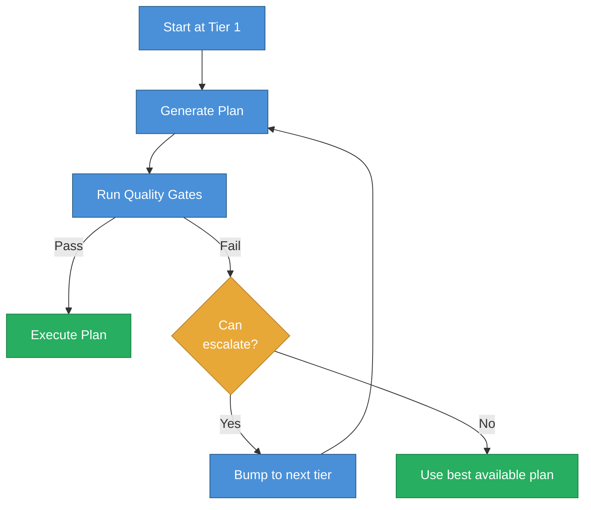

# Thinking Escalation

Agent Kernel includes a 4-tier reasoning system that automatically adjusts how much "thinking" to apply to each task. Instead of always using the most expensive model, the system starts cheap, validates the result, and escalates only when quality gates fail.

## The Three Components of Reasoning

What feels like "deep thinking" comes from three sources:

| Component | What It Is | Who Controls It |
|-----------|-----------|-----------------|
| **Model capability** | Raw intelligence ceiling | Model provider |
| **Deliberation budget** | How long the model thinks | You (via `reasoning_effort`) |
| **Workflow scaffolding** | Context, decomposition, critique, validation | Your kernel architecture |

You control 2 out of 3. Architecture helps you use model capability efficiently.

## The 4-Tier System

Each tier represents a different reasoning depth:

| Tier | Name | Model | Reasoning Effort | Use Case |
|------|------|-------|-----------------|----------|
| 0 | Routing | Lightweight model | `low` | Classification, routing, simple extraction |
| 1 | Standard | General model | `medium` | Normal planning, most tasks |
| 2 | Deep | Strong model | `high` | Complex analysis, ambiguous tasks |
| 3 | Deep + Critic | Strong model + critic pass | `high` | High stakes, requires verification |

### Tier Configuration

```yaml
tiers:
  0:
    name: routing
    model: gpt-4o-mini
    reasoning_effort: low
    max_tokens: 500
  1:
    name: standard
    model: gpt-4o
    reasoning_effort: medium
    max_tokens: 2000
  2:
    name: deep
    model: gpt-4o
    reasoning_effort: high
    max_tokens: 4000
  3:
    name: deep_with_critic
    model: gpt-4o
    reasoning_effort: high
    max_tokens: 4000
    run_critic: true
```

## Attempt -> Gate -> Escalate

The core pattern is evidence-driven escalation:



**Why this beats pre-classification:** You escalate based on actual failure signals, not predictions about task complexity.

## Quality Gates

Quality gates are deterministic validators that run after every plan generation:

1. **Schema validation** -- plan conforms to the Plan schema
2. **Citation check** -- all actions cite required context refs
3. **Constraint check** -- no external side effects without approval
4. **Coverage check** -- plan addresses the intent adequately
5. **Confidence check** -- model confidence above threshold

```python
class GateResult:
    passed: bool
    failures: list[str]
    warnings: list[str]
    confidence: float
    should_escalate: bool
    escalation_reason: str | None
```

## Escalation Triggers

The system escalates when it detects these signals:

| Trigger | Description |
|---------|-------------|
| `schema_validation_failed` | Plan does not match the expected schema |
| `quality_gates_failed` | Coverage, recency, or parity gates fail |
| `low_confidence` | Plan confidence below threshold (default 0.7) |
| `critic_rejection` | Critic pass recommends revision |
| `high_risk` | Risk assessment is high |
| `explicit_request` | User explicitly requests deep analysis |

## ThinkingConfig

The `ThinkingConfig` schema controls the entire reasoning pipeline:

```python
from agent_kernel.core.schemas import ThinkingConfig, EscalationConfig

config = ThinkingConfig(
    mode="adaptive",  # standard, deep, or adaptive
    escalation=EscalationConfig(
        enabled=True,
        start_tier=1,
        max_tier=3,
        triggers=[
            "quality_gates_failed",
            "low_confidence",
            "critic_rejection",
        ],
        confidence_threshold=0.7,
    ),
)
```

### Predefined Presets

Three built-in configurations cover common use cases:

```python
from agent_kernel.core.schemas import (
    STANDARD_THINKING,  # No escalation, tier 1 only
    DEEP_THINKING,      # Start at tier 2, critic enabled
    ADAPTIVE_THINKING,  # Start at tier 1, escalate on failure
)
```

## Agent Profile Integration

Attach a thinking config to an agent profile:

```yaml
agent_profile_id: analyst_agent
name: Deep Analyst
engine: custom
thinking_config:
  mode: adaptive
  escalation:
    enabled: true
    start_tier: 1
    max_tier: 3
    triggers:
      - quality_gates_failed
      - low_confidence
    require_approval_to_escalate: false
  verification:
    use_critic: true
    max_revisions: 2
```

## Critic Engine

For tier 3, a critic pass challenges the plan before execution:

```python
class Critique:
    issues: list[str]           # Problems found
    missing_context: list[str]  # Information gaps
    risk_flags: list[str]       # Potential risks
    recommended_changes: list[str]
    confidence_adjustment: float  # -0.3 to +0.1
```

The critic can trigger revision (the engine tries again with critique feedback) or rejection (escalation to a higher tier).

## Context Assembly by Tier

Higher tiers get richer context:

| Tier | Context Features |
|------|-----------------|
| 0-1 | Keyword + semantic search |
| 2+ | Graph expansion enabled |
| 3 | Iterative retrieval available |

## Reasoning Metadata in Traces

Every `DecisionTrace` captures reasoning decisions for analysis:

```python
class ReasoningMetadata:
    tier_used: int
    model_id: str
    reasoning_effort: str
    escalation_count: int
    escalation_reasons: list[str]
    gate_failures: list[str]
    critic_used: bool
    total_reasoning_tokens: int
```

This enables cost tracking, escalation rate monitoring, and tier optimization over time.

## CLI Commands

```bash
# View thinking configuration for an agent
agent-kernel show-thinking-config analyst_agent

# List available presets
agent-kernel list-thinking-presets

# Run a workflow with adaptive escalation
agent-kernel run-workflow-thinking daily_review

# View thinking metrics across recent traces
agent-kernel thinking-stats --since-hours 24
```

## Key Insight

**Don't pre-classify task complexity.** Try fast, validate with quality gates, and escalate on evidence. This approach:

- Uses expensive models only when needed
- Validates outputs before execution
- Keeps costs predictable
- Adapts automatically to task difficulty

## Next Steps

- [Architecture Guide](architecture.md) -- how thinking fits into the overall system
- [Tracing](../concepts/tracing.md) -- how reasoning metadata is captured
- [Framework Agnosticism](framework-agnosticism.md) -- how thinking works across engine backends
